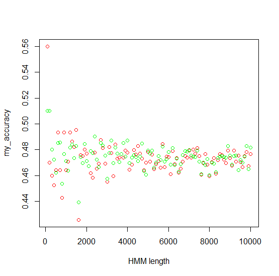
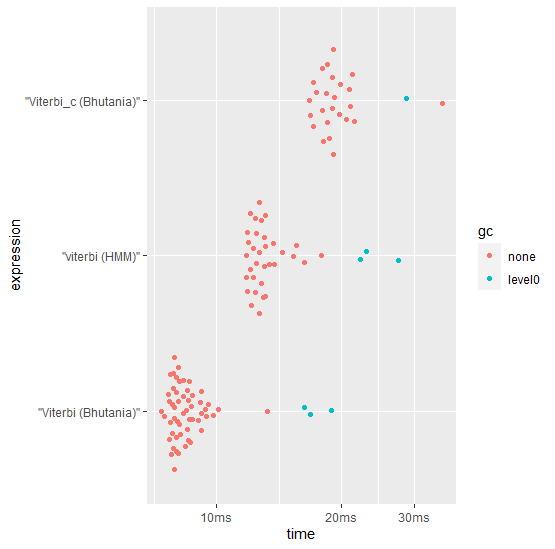

```{r,echo=FALSE,message=FALSE,warning=FALSE}
# Set so that long lines in R will be wrapped:
knitr::opts_chunk$set(tidy.opts=list(width.cutoff=80), tidy=TRUE)
```


```{r}
library(here)
devtools::load_all()
```


I have created a package with four different functions:
forward
backward
BaumWelch
viterbi

These functions may be viewed in the /R/ directory from the base project path. For ease, I have also shown them here.
```{r}
BhutaniaViterbi::forward


BhutaniaViterbi::backward


BhutaniaViterbi::BaumWelch


BhutaniaViterbi::Viterbi
```


I sourced these algorithms  from [this set of articles about HMM's](http://www.adeveloperdiary.com/data-science/machine-learning/introduction-to-hidden-markov-model/), [expectation maximization](http://www.adeveloperdiary.com/data-science/machine-learning/derivation-and-implementation-of-baum-welch-algorithm-for-hidden-markov-model/), and [the Viterbi algorithm](http://www.adeveloperdiary.com/data-science/machine-learning/implement-viterbi-algorithm-in-hidden-markov-model-using-python-and-r/). I have used their code as reference, and have attempted to make improvements to the Viterbi algorithm described in these articles using the techniques that we have learned in class.

Before diving into the algorithms, I would like to explain what the Viterbi algorithm is, and by extension what an HMM is. A Hidden Markov Model (HMM) is a two state model, where there are visible states, and hidden states. Visible states are states that can be observed, while hidden states are a related variable that can affect the outcome of the visible state, but are not directly observable themselves. These variables can be repeatedly sampled over a time (or similar consistently repetitive) series, creating what we call a Hidden Markov Model (HMM). A common example of a Hidden Markov Model is in speech recognition, where sound waves are used as the 'visible' state, while the characters and words that make up the sound byte are considered to be the 'hidden' state. To recognize speech, researchers use the Viterbi algorithm to find the most likely set of words or characters that make up the observed sound waves. 

The Viterbi algorithm is a powerful tool for analysis and allows one quickly to break down chunks of data into related meaningful observations. The viterbi algorithm does this by finding the most probable path of 'hidden' variables that result in the observed path of 'visible' variables, given the probability of switching from a hidden state to another hidden state over any given time series, and the probability of a given hidden state producing each visible output. The viterbi algorithm then uses the recursive algorithm: 

$p_h(v,t) = p_h(v)*max_k(p_k(j,t-1)*p_{kh})$ 

Where h is a hidden state, v is a given visible state, t is the time, k is the most probable previous hidden state, j is k's corresponding visible state, $p_{kh}$ represents the vector of probabilities of switching from state k to state h.  

This algorithm can then be converted to look like:

$p_h(v, t+1) = max_h(p_h(v, t)*p_{hk}*p_{kj})$

Where $p_{hk}$ is the probability of h transitioning to k, and $p_{kj} is the probability of k producing visible output j. Thus should we be given the first or last step of the equation, we can find the most probable sequence. This exactly what the following loop sampled from viterbi.R does:

```{r eval=FALSE}
  #Find the most likely hidden step for time step t.
  for(t in 2:time_step){
    for(s in 1:hidden_s) {
      #Find the probability of the next switch
      probs = omega[, t - 1] + log(switching[, s]) + log(visible[s, example[t]])
      #Find the largest probability of the switch
      prev[t - 1, s] = which.max(probs)
      #Find the probability of the most probable switch
      omega[s, t] = max(probs)
    }
  }
```

The rest of the algorithm, just converts the results of this loop into a readable result. 

I will not go into quite as much focus on the other three functions, as they were not the focus of my research, but I will go over their objectives. 

The BaumWelch algorithm attempts to run an expectation maximization on the parameter:

$\frac{p_h(t)*p_{hk}*p_{kj}*p_k(t+1)}{\sum_{h=1}^m\sum_{k =1}^mp_h(t)*p_{hk}*p_{kj}*p_k(t+1)}$

such that $p_{hk}$ and $p_{jk}$ are incrementally modified to maximize the probabilities of each hidden state producing the visible state over the entire time sequence. For more information, visit: [expectation maximization](http://www.adeveloperdiary.com/data-science/machine-learning/derivation-and-implementation-of-baum-welch-algorithm-for-hidden-markov-model/). 

The forward and backward algorithms are reversals of each other. They estimate the probabilities of each hidden variable at a time step based on a given a switching matrix and a visible matrix. The forward algorithm starts at the first time step, while the backward algorithm starts at the last time step. For more information visit: [forward and backward algorithms](http://www.adeveloperdiary.com/data-science/machine-learning/forward-and-backward-algorithm-in-hidden-markov-model/).

The algorithms performed admirably with the viterbi algorithm matching the accuracy of the HMM package, a R package that can construct HMMs and path trace using the Viterbi Algorithm. An acuracy graph one run can be seen in figure 1 below:

{height=300px width=400px}


This plot shows the results of comparing each viterbi algorithm against a HMM constructed by the simHMM function from the HMM package, with parameters trained from the Baum-Welch algorithm on the first example dataset. Each of the 100 HMMs tested were constructed with lengths ranging from 100 to 10000, with increments of 100. The accuracy was determined by counting each hidden state that was different from the constructed HMM, and then dividing by the length of the constructed HMM. Both algorithms hovered around 46-48% accuracy, which isn't exactly impressive. If I had more time, I would like to look into why these accuracies are so low.

The timing for my viterbi implementation is also superior as seen in figure 2 below:

{width=400px}

These timings were determined by running three different bench::mark timings on the original dataset. The timings were then plotted with the beeswarm plot method. It is interesting to note that the C implementation that I constructed was actually slower than the pure R implementation. The superior speed of my pure R package in comparison to the HMM package could be because my algorithm only has to deal with the possibility of an HMM with two hidden states and three visible states, thus allowing me to initialize and loop through my variables when the function is constructed by the compiler, as opposed to a potential dynamic approach that the HMM package might use which would require some sort of runtime or linker setup, which would take more time.

Now lets look specifically at the C implementation of the Viterbi algorithm. The only real changed part is where this section of the R code:
```{r eval=FALSE}
  #Find the most likely hidden step for time step t.
  for(t in 2:time_step){
    for(s in 1:hidden_s) {
      #Find the probability of the next switch
      probs = omega[, t - 1] + log(switching[, s]) + log(visible[s, example[t]])
      #Find the largest probability of the switch
      prev[t - 1, s] = which.max(probs)
      #Find the probability of the most probable switch
      omega[s, t] = max(probs)
    }
  }
```


is replaced with:
```{r eval=FALSE}
  cppFunction('
    using namespace Rcpp;

    // [[Rcpp::export]]
    void calculate_P(
    int hidden_s, int time_s, NumericMatrix &prev_m, 
    NumericMatrix &prob_m, NumericMatrix switching, 
    NumericMatrix visible, NumericMatrix example
    ){
      for(int i = 1; i < time_s; i++)
      {
        for(int j = 0; j < hidden_s; j++)
        {
          NumericVector probs = {};
          for(int k = 0; k < hidden_s; k++)
          {
            probs.insert(k, (prob_m(k, (i-1)) + log(switching(k, j)) + 
                            log(visible(j, example[i]-1))));
          }
          prev_m(i-1, j) = which_max(probs);
          prev_m(i-1, j)++;
          prob_m(j, i) = max(probs);
        }
      }
    }')

  calculate_P(hidden_s, time_step, prev, omega, as.matrix(switching), as.matrix(visible), as.matrix(example))
```

The two portions of code give the same result, however the C++ code requires an extra for loop loop, while the R code uses matrix addition which may account for the extra time taken during this operation.

In conclusion, the package that I have written evaluates 2, 3 transition, emission HMM's faster than the standard HMM package, and is just as accurate. While I believe there are ways to improve the package, such as through broadening the scope of HMM's evaluated, and potentially writing smaller loops in C++ to squeeze out more performance from the functions, I believe the result I have achieved is satisfactory for the scope of the project. Unfortunately I was unable to adapt this package to run on a distributed Kubernetes cluster, but I plan to do so in the future with a python implementation.


